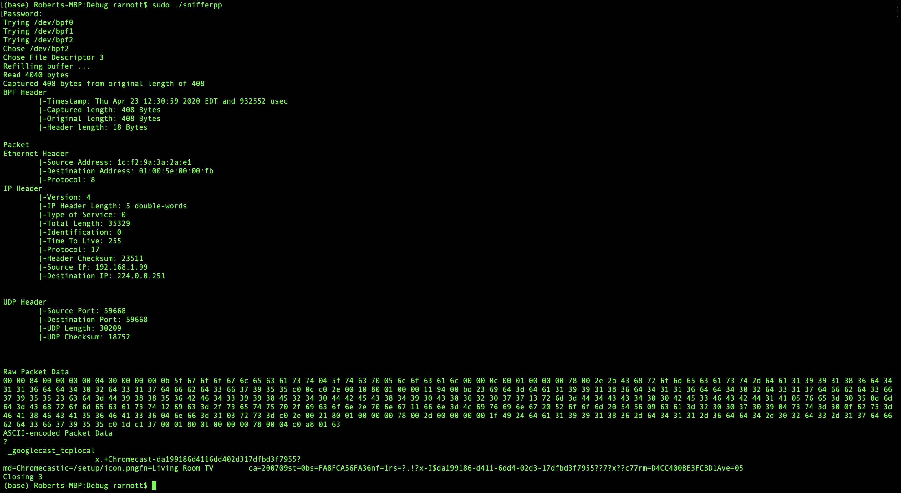

# snifferpp
Packet Sniffer I wrote while trying to replicate TCP in C++. I was developing on MacOS, so it uses Berklee Packet Filters (BPF) (MacOS does not allow you to access TCP and UDP packets via a raw socket as you would in linux).

Part of the goal here was to try to C++-ify a more traditionally C workflow, so you will see lots of classes here acting as resource handles (for example BPFDevice, which essentially manages the file descriptor for the BPF and helps buffer reads). 

main.cpp will fill the BPFDevice buffer and read packets until it gets one with a supported transport protocol (TCP and UDP currently, but fairly easy to add more). It then prints out the packet (with formatted header output and both raw and encoded payload)

If no such packet exists in the buffer, it will exit (one could instead just refill the buffer and keep trying). Given the buffer size of 4096 bytes (set in main) this is unlikely.

*Note using BPF Devices requires root permissions, so one has to use sudo to run the executable.

Example output:

